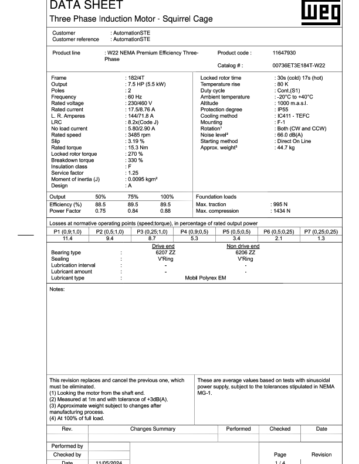
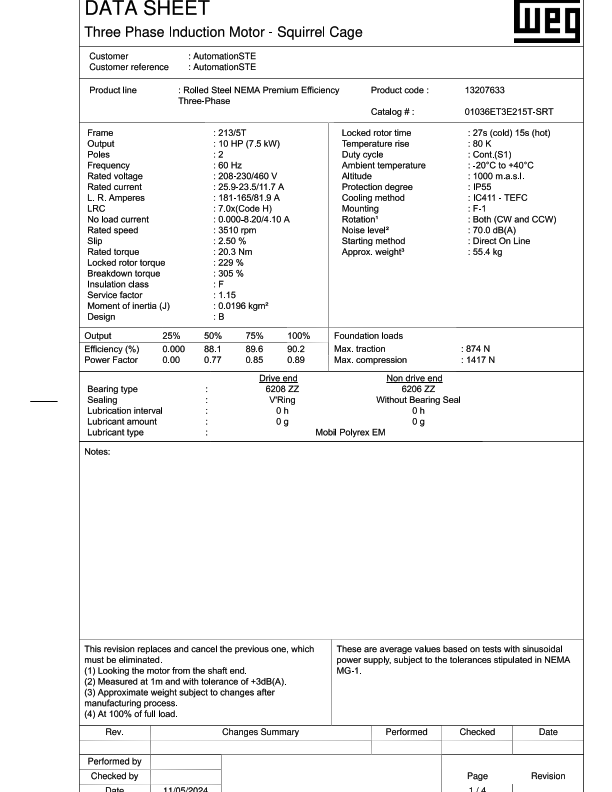
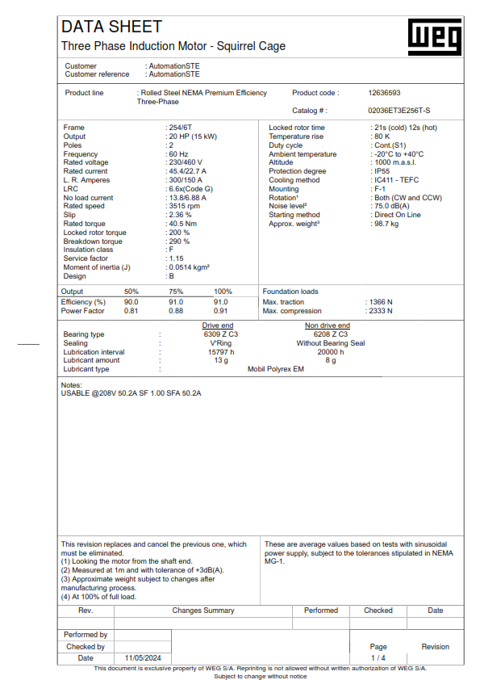
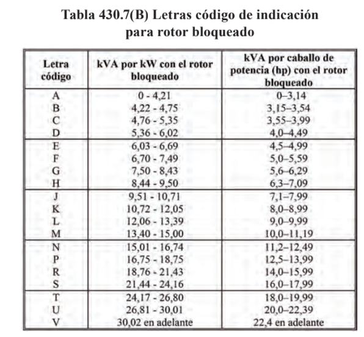
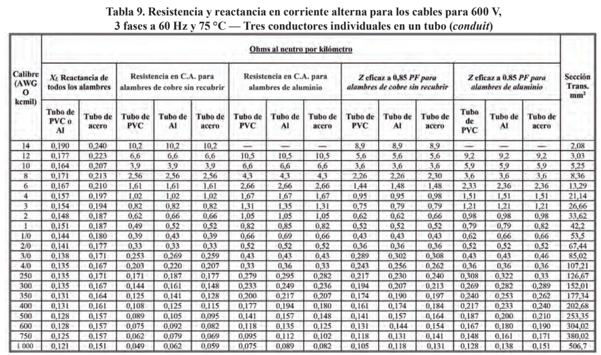
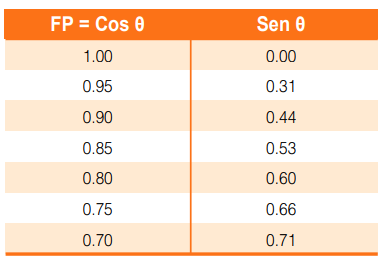
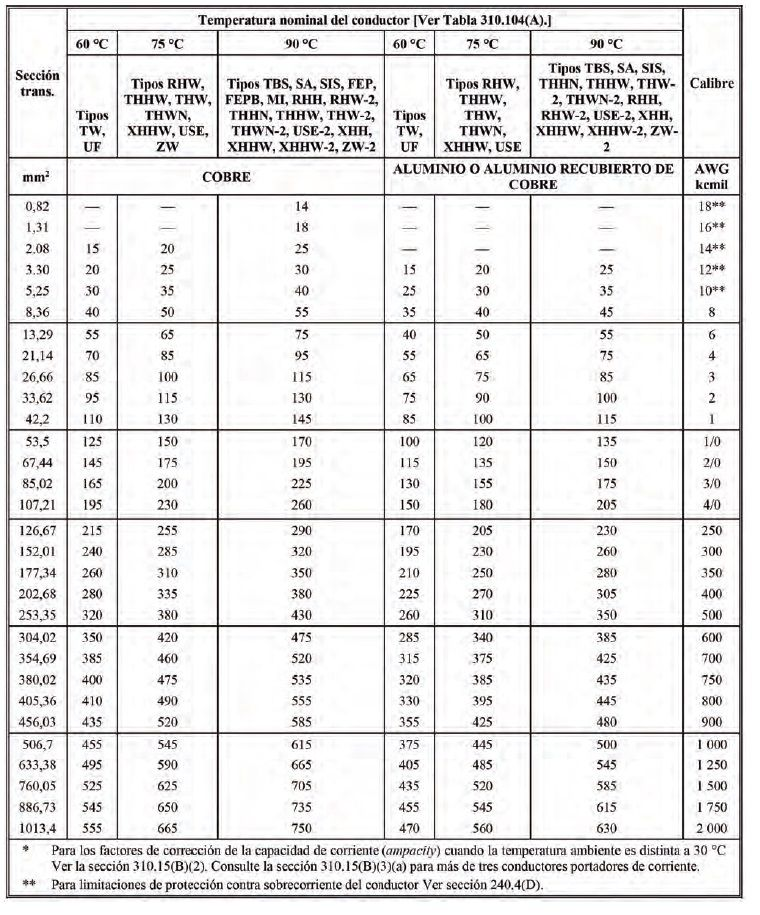

<!--  -->

# Proyecto Instalacion Motores Para La Empresa SONCOL SAS

### Realizado por Tec. Stiven Perez - AutomationSTE

A continuación se presentan los datos técnicos y calculos eléctricos para cada motor previamente seleccionado en campo en base al requerimiento de potencia del sinfin a instalar. El arranque de los motores se realizara por arrancador directo.

La instalación se realizara con una tensión de alimentación de 480V.

<!-- MOTOR A -->
- **Motor Sinfin A**
Este motor será instalado a una distancia de 50m del tablero de circuito alimentador.

1. **Cálculos**
    1.1 **Cálculo de corriente nominal**   

    

    $I_n = \cfrac {P/\eta}{\sqrt{3} * V_{LL} * fp}$

    

    Donde:

    P Potencia mecánica nominal en HP
    $\eta$ Eficiencia del motor
    $V_{LL}$ Tensión de alimentación trifásica
    $fp$ Factor de potencia   

    Por lo tanto:   

    

    $I_n = \cfrac {7.5*746/0.89}{\sqrt{3} * 460 * 0.88}$

    $I_n = 8.97A$   

    <!-- $I_n = 6.81 * 1.25 =  8.51A$ -->

    

    1.2 **Cálculo de corriente de rotor bloqueado LRC**   

    

    $LRC = \cfrac {Hp*Codigo*1000}{V*\sqrt{3}}$

    

    *Letra código tomada de la tabla 430.7(B) [^1], de la NTC 2050. Se toma el valor máximo de la letra KVA/Hp*

    

    $LRC = \cfrac {7.5Hp*7.99kVA*1000}{460*\sqrt{3}}$

    $LRC = 75.3A$

    
  

    1.3 **Cálculo de corriente de conductor**

       

    

    $I_c = 8.97 * 1.25$
    $I_c = 11.2A$

    

    *Se toma en referencia la norma NTC 2050, articulo 210.19, inciso B, numeral 1*

    

    
 

    Por lo tanto se toma un calibre **14AWG**, en base a la tabla 310.15(B)(16) [^4] de la normal NTC 2050, el RETIE indica que instalaciones menores a 100A se puede tomar el conductor en base a la tabla de ampacidad columna 60°C.   

    1.4 **Cálculo de regulación de tensión**
     

    

    $\Delta V_{L-L} = \sqrt{3} * \Delta V_{F-N}$

    

    Donde:

    $\Delta V_{L-L}$ Caída de tensión trifásica
    $\Delta V_{F-N}$ Caída de tensión monofásica
     
    Regulación
    

    $\%Regulación = [\Delta V_{L-L} / Vr] * 100$

    

    Donde:
    $Vr$ Tensión de línea   

    Por lo tanto para efectos del cálculo, el motor estará ubicado a longitud de 50m
     

    1.4.1 **Cálculo de impedancia eficaz**   

    

    $Z_{EF} = R \cos \theta + X_L \sin \theta$
    $R = 10.17 \varOmega/km$
    $X_L = 0.240 \varOmega/km$
    $Z_{EF} = (10.17 * 0.88) + (0.240 * 0.53)$
    $Z_{EF} = 9.076\varOmega/km$

    

    *Valores de $R$ y $X_L$ tomados de la tabla 9, [^2] de la NTC 2050
    Valor de $\sin$ tomado de la tabla 1, [^3] de la NTC 2050*

    

    

    1.4.2 **Cálculo de caída de tensión**   

    

    $\Delta V_{L-N} = Z_{EF} * L * I$
    $\Delta V_{L-N} = 9.076\varOmega/km * 0.05km * 8.97$
    $\Delta V_{L-N} = 4.07V$

     

    $\Delta V_{L-L} = \sqrt{3} * \Delta V_{L-N}$
    $\Delta V_{L-L} = \sqrt{3} * 4.07V$
    $\Delta V_{L-L} = 7.04V$

    

    1.4.3 **% Regulación**   

    

    $\% V_{L-L} = (\Delta V / Vr) * 100$
    $\% V_{L-L} = (7.04V / 460V) * 100$
    $\% V_{L-L} = 1.5\%$

    

    *La norma NTC 2050 Sección 210-19, Inciso A, Nota 4, estipula que el circuito ramal no debe superar el 3% de regulación*

    
    

     

<!-- MOTOR B -->
- **Motor Sinfin B**

Este motor será instalado a una distancia de 60m del tablero de circuito alimentador.

2. **Cálculos**
    2.1 **Cálculo de corriente nominal**   

    

    $I_n = \cfrac {P/\eta}{\sqrt{3} * V_{LL} * fp}$

    

    Donde:

    P Potencia mecánica nominal en HP
    $\eta$ Eficiencia del motor
    $V_{LL}$ Tensión de alimentación trifásica
    $fp$ Factor de potencia   

    Por lo tanto:   

    

    $I_n = \cfrac {10*746/0.90}{\sqrt{3} * 460 * 0.89}$

    $I_n = 11.7A$   

    

    2.2 **Cálculo de corriente de rotor bloqueado LRC**   

    

    $LRC = \cfrac {Hp*Codigo*1000}{V*\sqrt{3}}$

    

    *Letra código tomada de la tabla 430.7(B) [^1], de la NTC 2050. Se toma el valor máximo de la letra KVA/Hp*

    

    $LRC = \cfrac {10Hp*7.09kVA*1000}{460*\sqrt{3}}$

    $LRC = 89A$

    
  

    2.3 **Cálculo de corriente de conductor**

       

    

    $I_c = 11.7 * 1.25$
    $I_c = 14.6A$

    

    *Se toma en referencia la norma NTC 2050, articulo 210.19, inciso B, numeral 1*

    

    
 

    Por lo tanto se toma un calibre **14AWG**, en base a la tabla 310.15(B)(16) [^4] de la normal NTC 2050, el RETIE indica que instalaciones menores a 100A se puede tomar el conductor en base a la tabla de ampacidad columna 60°C.   

    2.4 **Cálculo de regulación de tensión**
     

    

    $\Delta V_{L-L} = \sqrt{3} * \Delta V_{F-N}$

    

    Donde:

    $\Delta V_{L-L}$ Caída de tensión trifásica
    $\Delta V_{F-N}$ Caída de tensión monofásica
     
    Regulación
    

    $\%Regulación = [\Delta V_{L-L} / Vr] * 100$

    

    Donde:
    $Vr$ Tensión de línea   

    Por lo tanto para efectos del cálculo, el motor estará ubicado a longitud de 60m
     

    2.4.1 **Cálculo de impedancia eficaz**   

    

    $Z_{EF} = R \cos \theta + X_L \sin \theta$
    $R = 10.17 \varOmega/km$
    $X_L = 0.240 \varOmega/km$
    $Z_{EF} = (10.17 * 0.89) + (0.240 * 0.53)$
    $Z_{EF} = 9.18\varOmega/km$

    

    *Valores de $R$ y $X_L$ tomados de la tabla 9, [^2] de la NTC 2050
    Valor de $\sin$ tomado de la tabla 1, [^3] de la NTC 2050*

    

    

    2.4.2 **Cálculo de caída de tensión**   

    

    $\Delta V_{L-N} = Z_{EF} * L * I$
    $\Delta V_{L-N} = 9.18\varOmega/km * 0.06km * 11.7$
    $\Delta V_{L-N} = 6.44V$

     

    $\Delta V_{L-L} = \sqrt{3} * \Delta V_{L-N}$
    $\Delta V_{L-L} = \sqrt{3} * 6.44V$
    $\Delta V_{L-L} = 11V$

    

    2.4.3 **% Regulación**   

    

    $\% V_{L-L} = (\Delta V / Vr) * 100$
    $\% V_{L-L} = (11V / 460V) * 100$
    $\% V_{L-L} = 2.4\%$

    

    *La norma NTC 2050 Sección 210-19, Inciso A, Nota 4, estipula que el circuito ramal no debe superar el 3% de regulación*

    
    

     

<!-- MOTOR C -->
- **Motor SinfinC**

Este motor será instalado a una distancia de 35m del tablero de circuito alimentador.

3. **Cálculos**
    3.1 **Cálculo de corriente nominal**   

    

    $I_n = \cfrac {P/\eta}{\sqrt{3} * V_{LL} * fp}$

    

    Donde:

    P Potencia mecánica nominal en HP
    $\eta$ Eficiencia del motor
    $V_{LL}$ Tensión de alimentación trifásica
    $fp$ Factor de potencia   

    Por lo tanto:   

    

    $I_n = \cfrac {20*746/0.91}{\sqrt{3} * 460 * 0.91}$

    $I_n = 22.6A$   

    <!-- $I_n = 6.81 * 1.25 =  8.51A$ -->

    

    3.2 **Cálculo de corriente de rotor bloqueado LRC**   

    

    $LRC = \cfrac {Hp*Codigo*1000}{V*\sqrt{3}}$

    $LRC = \cfrac {20Hp*6.29kVA*1000}{460*\sqrt{3}}$

    $LRC = 158A$

    

    *Letra código tomada de la tabla 430.7(B) [^1], de la NTC 2050. Se toma el valor máximo de la letra KVA/Hp*

    

    
  

    3.3 **Cálculo de corriente de conductor**

       

    

    $I_c = 22.6 * 1.25$
    $I_c = 28A$

    

    *Se toma en referencia la norma NTC 2050, articulo 210.19, inciso B, numeral 1*

    

    
 

    Por lo tanto se toma un calibre **10AWG**, en base a la tabla 310.15(B)(16) [^4] de la normal NTC 2050, el RETIE indica que instalaciones menores a 100A se puede tomar el conductor en base a la tabla de ampacidad columna 60°C.   

    3.4 **Cálculo de regulación de tensión**
     

    

    $\Delta V_{L-L} = \sqrt{3} * \Delta V_{F-N}$

    

    Donde:

    $\Delta V_{L-L}$ Caída de tensión trifásica
    $\Delta V_{F-N}$ Caída de tensión monofásica
     
    Regulación
    

    $\%Regulación = [\Delta V_{L-L} / Vr] * 100$

    

    Donde:
    $Vr$ Tensión de línea   

    Por lo tanto para efectos del cálculo, el motor estará ubicado a longitud de 35m
     

    3.4.1 **Cálculo de impedancia eficaz**   

    

    $Z_{EF} = R \cos \theta + X_L \sin \theta$
    $R =  3.9\varOmega/km$
    $X_L =  0.207\varOmega/km$
    $Z_{EF} = (3.9 * 0.91) + (0.207 * 0.44)$
    $Z_{EF} = 3.64\varOmega/km$

    

    *Valores de $R$ y $X_L$ tomados de la tabla 9, [^2] de la NTC 2050
    Valor de $\sin$ tomado de la tabla 1, [^3] de la NTC 2050*

    

    

    3.4.2 **Cálculo de caída de tensión**   

    

    $\Delta V_{L-N} = Z_{EF} * L * I$
    $\Delta V_{L-N} = 3.64\varOmega/km * 0.035km * 22.6$
    $\Delta V_{L-N} = 2.87V$

     

    $\Delta V_{L-L} = \sqrt{3} * \Delta V_{L-N}$
    $\Delta V_{L-L} = \sqrt{3} * 2.87V$
    $\Delta V_{L-L} = 4,97V$

    

    3.4.3 **% Regulación**   

    

    $\% V_{L-L} = (\Delta V / Vr) * 100$
    $\% V_{L-L} = (4.97V / 460V) * 100$
    $\% V_{L-L} = 1.08\%$

    

    *La norma NTC 2050 Sección 210-19, Inciso A, Nota 4, estipula que el circuito ramal no debe superar el 3% de regulación*

    
    

     

 <!-- TABLAS -->

 

# Tablas de referencia

[^1]: ***Tabla 430.7(B)***

[^2]: ***Tabla 9***

[^3]: ***Tabla 1***

[^4]: ***Tabla 310.15***

**The Cauchy-Schwarz Inequality**
$$\left( \sum_{k=1}^n a_k b_k \right)^2 \leq \left( \sum_{k=1}^n a_k^2 \right) \left( \sum_{k=1}^n b_k^2 \right)$$
